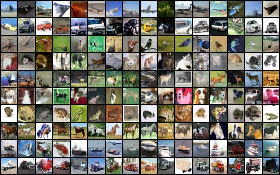

# Implementation of Diffusion Networks

This is my implementation of Diffusion Networks, but for low resolution images. THe model was trained on CIFAR-10 images, this model can further be scaled for larger images

##  Requirements

Use the .YAML file to create a virtual environment and train the model, run the below code create "diffusion" virtual environment 

```conda env create -f environment.yaml```

## Files in the repository and their usage

models.py: Contains the UNet architecture model and the Diffusion model that was used

train_prototype.ipynb: Contains code to download, train and infer the diffusion model

environment.yaml: Generated file that contains all the dependencies I used to work on this project, Used to create a Virtual environment

## Instructions to train the model or generate images using inference model

Run the Cells of the Jupyter Notebook to train the model or use it to generate any images

Make any changes in the architecture in the models.py file

## Visualizing real and synthetic images

#### CIFAR-10
<p align="center">
  
</p>

## References

This implementation was based on the [original implmentation](https://github.com/hojonathanho/diffusion) of diffusion models by Jonathan Ho. I followed the recent [PyTorch implementation](https://github.com/hojonathanho/diffusion) by OpenAI for common design choices in diffusion models. 

This experiment is for me to learn the diffusion process, and build upon this in future
